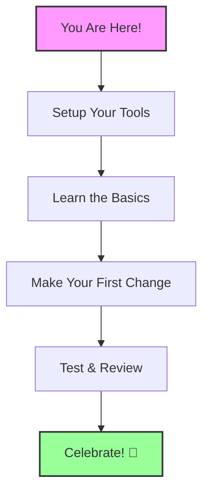

# Welcome to Valentelligent AI! 👋

## Getting Started for Complete Beginners

Think of this project like building a house 🏠:
- The foundation (React) is like the concrete base
- The walls (Components) are like LEGO blocks that fit together
- The paint and decorations (Styles) make everything look beautiful

### Your Journey Map


### Why This Matters 💡
- Modern websites need to be fast, beautiful, and user-friendly
- Our tools help you create professional-looking pages easily
- You'll learn skills used by top tech companies

## Tools You'll Need (Like a Toolbox 🧰)

1. **Node.js** - Think of it as your project's engine
   - Download from: nodejs.org
   - Just like a car needs an engine to run, your project needs Node.js!

2. **Code Editor** - Like a word processor, but for code
   - We recommend VS Code
   - It's like Microsoft Word, but for programming

3. **Web Browser** - Your window to view your creation
   - Chrome or Firefox recommended
   - Think of it as your project's mirror

## Step-by-Step Tutorial (With Pictures! 📸)

### 1. Setting Up Your Project

```
Your Project Structure
📁 Project Root
├── 📁 src (Your source code - like a kitchen)
│   ├── 📁 components (Ingredients)
│   ├── 📁 styles (Recipe book)
│   └── 📄 main.tsx (Main recipe)
└── 📁 public (Ready-to-serve dishes)
```

### 2. Making Your First Change

Before:
```jsx
<Button>Old Button</Button>
```

After:
```jsx
<Button className="button-gradient">
  ✨ Beautiful Button ✨
</Button>
```

See how easy that was? 🌟

### 3. Understanding the Building Blocks

Think of components like building blocks:
```
🟦 Header     - Like the roof
🟨 Hero       - Your home's entrance
🟩 Features   - The rooms
🟪 Footer     - The foundation
```

## Common Questions (You're Not Alone! 🤝)

### "Help! My changes aren't showing up!"
✅ Did you save the file?
✅ Is your development server running?
✅ Try refreshing the page

### "The styles look wrong..."
✅ Check your class names
✅ Make sure you're using the right component
✅ Verify your imports

## Success Indicators 🎯

- [ ] Development server running
- [ ] No error messages in console
- [ ] Page loads without crashes
- [ ] Animations work smoothly
- [ ] All links work correctly

## Best Practices (Your Recipe for Success 🌟)

1. **Keep It Simple**
   - Start small
   - Add features one at a time
   - Test as you go

2. **Stay Organized**
   - Name files clearly
   - Group similar components
   - Comment your code

3. **Test Everything**
   - Check on different devices
   - Verify all features work
   - Ask for feedback

## Need Help? 🆘

- Check the documentation
- Ask in our community
- Don't be afraid to experiment!

Remember: Every expert was once a beginner. You've got this! 💪
