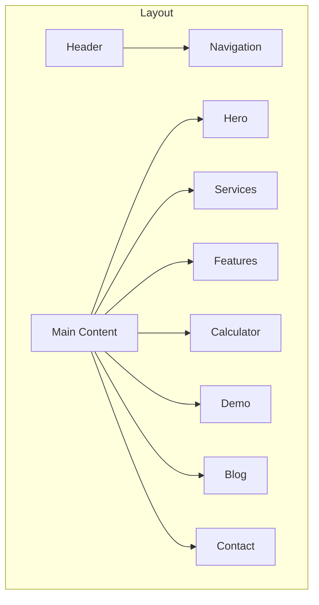

# Valentelligent AI Landing Page - User Guide

## Table of Contents

1. [Introduction](#introduction)
2. [Getting Started](#getting-started)
3. [Layout Structure](#layout-structure)
4. [Component Customization](#component-customization)
5. [Performance Optimization](#performance-optimization)
6. [Accessibility Guidelines](#accessibility-guidelines)
7. [Troubleshooting](#troubleshooting)

## Introduction

### What is this landing page?
The Valentelligent AI landing page is a modern website that showcases AI-related services and products. It features beautiful animations, interactive sections, and a clean, professional design.

### Basic Requirements
- A computer with internet access
- A modern web browser (Chrome, Firefox, or Safari)
- Basic familiarity with web development concepts

## Layout Structure



### Responsive Grid System
```
Desktop Layout (1200px+)
┌────────────────────────┐
│        Header          │
├────────────────────────┤
│         Hero           │
├────┬────────────┬─────┤
│Feat│  Content   │ Side│
│ure │            │     │
├────┴────────────┴─────┤
│        Footer         │
└────────────────────────┘

Mobile Layout (<768px)
┌──────────────┐
│    Header    │
├──────────────┤
│     Hero     │
├──────────────┤
│   Features   │
├──────────────┤
│   Content    │
├──────────────┤
│    Footer    │
└──────────────┘
```

## Step-by-Step Tutorials

### 1. Adding a New Section

```jsx
// 1. Create a new component file
// client/src/components/NewSection.tsx

import { motion } from "framer-motion";
import { fadeIn } from "@/lib/animations";

export default function NewSection() {
  return (
    <section className="py-20">
      <motion.div
        initial="hidden"
        animate="visible"
        variants={fadeIn}
      >
        {/* Your content here */}
      </motion.div>
    </section>
  );
}

// 2. Add to Home.tsx
import NewSection from "@/components/NewSection";

export default function Home() {
  return (
    <div>
      <Header />
      <NewSection />
      {/* Other sections */}
    </div>
  );
}
```

### 2. Customizing Components

#### Button Customization
```jsx
// Basic Button
<Button>Click Me</Button>

// Gradient Button
<Button className="button-gradient">
  Gradient Button
</Button>

// Outlined Button
<Button variant="outline" className="gradient-border">
  Outlined Button
</Button>
```

#### Card Customization
```jsx
// Basic Card
<Card>
  <CardHeader>
    <CardTitle>Title</CardTitle>
  </CardHeader>
  <CardContent>
    Content here
  </CardContent>
</Card>

// Enhanced Card
<Card className="card-elite hover:shadow-xl">
  <CardHeader className="space-y-4">
    <CardTitle className="gradient-text">
      Enhanced Title
    </CardTitle>
  </CardHeader>
</Card>
```

## Performance Optimization

### 1. Image Optimization
```jsx
// Bad Example


// Good Example
<picture>
  <source
    srcSet="image-small.webp"
    media="(max-width: 768px)"
    type="image/webp"
  />
  <source
    srcSet="image-large.webp"
    type="image/webp"
  />
  
</picture>
```

### 2. Component Optimization
```jsx
// Use React.memo for expensive components
const ExpensiveComponent = React.memo(({ data }) => {
  return <div>{/* Complex rendering */}</div>;
});

// Use useMemo for expensive calculations
const memoizedValue = useMemo(() => {
  return expensiveOperation(dependencies);
}, [dependencies]);
```

## Accessibility Guidelines

### 1. Semantic HTML
```jsx
// Bad
<div onClick={handleClick}>Click me</div>

// Good
<button
  onClick={handleClick}
  aria-label="Submit form"
>
  Click me
</button>
```

### 2. ARIA Attributes
```jsx
// Navigation
<nav aria-label="Main navigation">
  <ul role="menubar">
    <li role="menuitem">
      <a href="#services">Services</a>
    </li>
  </ul>
</nav>

// Form Labels
<form>
  <label htmlFor="name">Name</label>
  <input
    id="name"
    aria-required="true"
    aria-invalid={errors.name ? "true" : "false"}
  />
</form>
```

### 3. Focus Management
```css
/* Visible focus indicators */
:focus {
  outline: 2px solid var(--primary);
  outline-offset: 2px;
}

/* Focus visible only when using keyboard */
:focus:not(:focus-visible) {
  outline: none;
}
```

## Troubleshooting

### Common Issues

1. **Styles Not Applying**
   - Clear browser cache
   - Rebuild Tailwind: `npm run build:css`
   - Check class name conflicts

2. **Animations Not Working**
   - Verify Framer Motion import
   - Check variant names
   - Ensure proper component mounting

3. **Performance Issues**
   - Implement code splitting
   - Optimize images
   - Use React.memo and useMemo
   - Enable tree shaking

4. **Mobile Responsiveness**
   - Test on multiple devices
   - Use browser dev tools
   - Check viewport settings

### Debug Tools

1. React Developer Tools
```javascript
// Enable React Dev Tools
if (process.env.NODE_ENV === 'development') {
  const ReactDOM = require('react-dom');
  ReactDOM.render(<App />, document.getElementById('root'));
}
```

2. Performance Monitoring
```javascript
// Add performance marks
performance.mark('componentStart');
// Your component code
performance.mark('componentEnd');
performance.measure('componentRender', 'componentStart', 'componentEnd');
```

Remember: Always test thoroughly on multiple devices and browsers before deploying changes!
