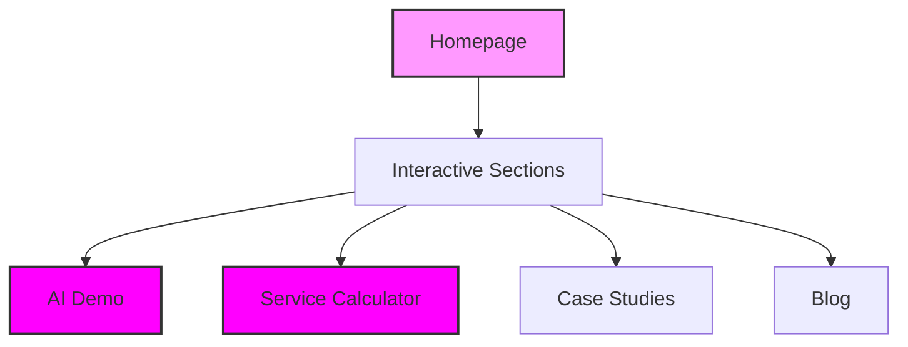

# Valentelligent AI Landing Page ✨

Welcome to our modern, user-friendly landing page project! This guide will help you get started with confidence.

## 🎯 Project Overview

Think of this project as a digital storefront that showcases AI services in a beautiful, interactive way.



### ✨ Key Features

Each feature is like a building block that makes our page special:

- 🎨 Beautiful animated sections that catch the eye
- 🤖 Interactive AI demo that shows our capabilities
- 💰 Smart calculator that helps estimate service costs
- 📱 Works perfectly on phones, tablets, and computers
- 🎭 Smooth animations that make the page feel alive
- 📚 Resource section with helpful articles
- 📊 Success stories from real projects
- 📬 Easy-to-use contact form

## 🚀 Getting Started

### Step 1: Setup (Your Project's Foundation)

1. Make sure you have:
   - Node.js (v18 or newer) - Your project's engine
   - Git - Your project's time machine
   - A modern web browser - Your window to the world

### Step 2: Installation (Building Your Workspace)

```bash
# Get the project files
git clone <repository-url>

# Move into the project folder
cd valentelligent-ai

# Install the building blocks
npm install

# Start the development server
npm run dev
```

### Step 3: Your First Change

Let's make a simple change to see how everything works:

```jsx
// Before
<Button>Click Me</Button>

// After - Now it's beautiful!
<Button className="button-gradient">
  ✨ Click Me
</Button>
```

## 🎨 Customization Guide

### Colors
```css
/* Change these colors to match your brand */
:root {
  --primary: 262.1 83.3% 57.8%;    /* Your main color */
  --secondary: 240 4% 96%;         /* Your accent color */
}
```

### Adding New Sections
```jsx
// It's as easy as adding this to your page
import NewSection from '@/components/NewSection';

<div>
  <Header />
  <NewSection />  {/* Your new section appears here */}
  <Footer />
</div>
```

## 🔍 Progress Checkpoints

### Getting Started
- [ ] Project files downloaded
- [ ] Dependencies installed
- [ ] Development server running

### Basic Customization
- [ ] Updated colors to match your brand
- [ ] Modified text content
- [ ] Tested all interactive features

### Final Touches
- [ ] Checked on mobile devices
- [ ] Verified all links work
- [ ] Tested contact form

## 🛠️ Troubleshooting

Having issues? Let's fix them together!

### Common Solutions

1. If things aren't updating:
   ```bash
   # Clear everything and start fresh
   npm cache clean --force
   rm -rf node_modules
   npm install
   ```

2. If styles aren't working:
   ```bash
   # Rebuild the styles
   npm run build:css
   ```

## 🌟 Success Tips

1. **Start Small**
   - Make one change at a time
   - Test each change
   - Build up gradually

2. **Keep Organized**
   - Name files clearly
   - Comment your code
   - Keep similar things together

3. **Test Thoroughly**
   - Check on different devices
   - Test all features
   - Get feedback from others

## 🤝 Contributing

We'd love your help! Here's how to contribute:

1. Fork the project
2. Create your feature branch
3. Make your changes
4. Test everything
5. Submit a pull request

## 📝 License
MIT License - Feel free to use this in your own projects!

Remember: Every amazing website started with a single line of code. You've got this! 💪
