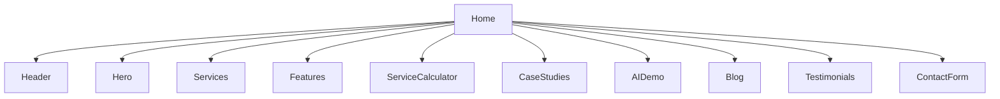

# Valentelligent AI Landing Page

A modern, responsive landing page showcasing AI solutions and services with interactive components and elegant animations.

## Component Hierarchy



## Project Overview

### Description
Valentelligent AI is a sophisticated landing page designed to showcase AI services and solutions. It features a modern, responsive layout with interactive components, smooth animations, and a comprehensive service showcase.

### Key Features
- 🎨 Animated hero section with gradient effects
- 🔄 Sticky navigation with smooth scroll
- 💡 Interactive AI demo with chat interface
- 📊 Dynamic service calculator
- 📱 Fully responsive design
- 🎭 Animated components with Framer Motion
- 📝 Blog/resources section
- 🎯 Case studies carousel
- 📬 Contact form with validation

## Tech Stack for Beginners

### Frontend Framework: React
React is like building with LEGO blocks - each piece (component) can be reused and combined to create complex interfaces.
```jsx
// Example of a simple React component
function Welcome() {
  return <h1>Hello, Welcome to our site!</h1>;
}
```

### Styling: Tailwind CSS
Tailwind is like having a huge box of pre-made styling tools. Instead of writing CSS, you use ready-made classes.
```jsx
// Example of Tailwind styling
<button className="bg-blue-500 hover:bg-blue-700 text-white font-bold py-2 px-4 rounded">
  Click me
</button>
```

### UI Components: Shadcn UI
Shadcn provides beautiful, pre-built components that you can customize easily.
```jsx
// Example of a Shadcn button
import { Button } from "@/components/ui/button";

<Button variant="gradient">Click me</Button>
```

### Animations: Framer Motion
Framer Motion makes adding animations as simple as adding a few props to your components.
```jsx
// Example of a simple animation
<motion.div
  initial={{ opacity: 0 }}
  animate={{ opacity: 1 }}
  transition={{ duration: 0.5 }}
>
  I will fade in!
</motion.div>
```

## Comprehensive Setup Guide

### Prerequisites
1. Install Node.js (v18 or higher)
   - Visit nodejs.org
   - Download and install the LTS version
   - Verify installation: `node --version`

2. Install Git
   - Visit git-scm.com
   - Download and install
   - Verify installation: `git --version`

### Step-by-Step Installation
1. Clone the repository:
```bash
git clone <repository-url>
cd valentelligent-ai
```

2. Install dependencies:
```bash
npm install
```

3. Start development server:
```bash
npm run dev
```

### Common Customization Examples

1. Changing the color scheme:
```css
/* In client/src/index.css */
:root {
  --primary: 262.1 83.3% 57.8%;    /* Purple */
  --secondary: 240 4% 96%;         /* Light Gray */
}
```

2. Adding a new section:
```jsx
// In client/src/pages/Home.tsx
import NewSection from '@/components/NewSection';

export default function Home() {
  return (
    <div>
      <Header />
      <NewSection />  {/* Add your new section */}
      <Footer />
    </div>
  );
}
```

3. Customizing animations:
```jsx
// In client/src/lib/animations.ts
export const customAnimation = {
  hidden: { opacity: 0, y: 20 },
  visible: {
    opacity: 1,
    y: 0,
    transition: { duration: 0.5 }
  }
};
```

### Troubleshooting Guide

#### Common Issues and Solutions

1. **Node Version Mismatch**
   - Error: "Unsupported Node.js version"
   - Solution: Update Node.js to v18 or higher
   ```bash
   nvm install 18
   nvm use 18
   ```

2. **Dependencies Not Found**
   - Error: "Cannot find module..."
   - Solution: Clear cache and reinstall
   ```bash
   npm cache clean --force
   rm -rf node_modules
   npm install
   ```

3. **Build Errors**
   - Error: "Build failed with exit code 1"
   - Solution: Check for TypeScript errors
   ```bash
   npm run type-check
   ```

4. **Styling Issues**
   - Problem: Tailwind classes not working
   - Solution: Rebuild Tailwind cache
   ```bash
   npm run build:css
   ```

## Performance Optimization Tips

1. **Image Optimization**
   - Use WebP format
   - Implement lazy loading
   - Use responsive images
   ```jsx
   
   ```

2. **Code Splitting**
   ```jsx
   const MyComponent = React.lazy(() => import('./MyComponent'));
   ```

3. **Memoization**
   ```jsx
   const MemoizedComponent = React.memo(ExpensiveComponent);
   ```

## Contributing
1. Fork the repository
2. Create a feature branch
3. Commit changes
4. Push to the branch
5. Open a pull request

## License
MIT License
