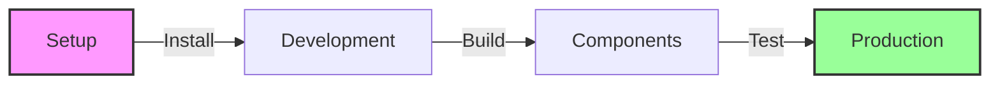

# Valentelligent AI Landing Page 🚀

> Enterprise-grade AI solutions landing page featuring modern design, interactive components, and comprehensive documentation.

## 🌟 Features

- **Modern Design**
  - Responsive layout with animated hero section
  - Sticky navigation with smooth scrolling
  - Interactive UI components with Shadcn
  - Framer Motion animations

- **Core Components**
  - AI Demo chat interface
  - Service calculator with real-time pricing
  - Case studies carousel
  - Blog/resources grid

- **Technical Stack**
  - React + Vite
  - Tailwind CSS
  - Shadcn UI
  - Framer Motion
  - TypeScript

## 🚀 Quick Start

1. **Clone & Install**
   ```bash
   git clone [repository-url]
   cd valentelligent-ai
   npm install
   ```

2. **Development**
   ```bash
   npm run dev
   ```

   Visit `http://localhost:5000` to see the application.

## 📚 Documentation

Our documentation is organized into three main guides:

1. **[Getting Started](GUIDE.md)**
   - Project setup
   - Component overview
   - Development guidelines

2. **[Image Guidelines](client/src/components/IMAGES_GUIDE.md)**
   - Image optimization
   - Format selection
   - Performance tips

3. **Component Structure**
   ```
   📁 client/src/
   ├── 📁 components/     # UI Components
   ├── 📁 lib/           # Utilities
   └── 📁 pages/         # Page layouts
   ```

## 🎯 Key Features Walkthrough

1. **Interactive AI Demo**
   - Real-time chat simulation
   - Pre-configured prompts
   - Animated responses

2. **Service Calculator**
   - Dynamic pricing
   - Real-time updates
   - Custom form validation

3. **Case Studies**
   - Interactive carousel
   - Success metrics
   - Responsive layout

4. **Blog/Resources**
   - Category-based filtering
   - Responsive grid
   - Optimized images

## 🛠 Development Flow



## 🔧 Configuration

Key configuration files:
- `vite.config.ts` - Build configuration
- `tailwind.config.ts` - Styling framework
- `tsconfig.json` - TypeScript settings

## 🤝 Contributing

1. Fork the repository
2. Create your feature branch
3. Commit your changes
4. Push to the branch
5. Open a Pull Request

## 📝 License

MIT License - see [LICENSE](LICENSE) for details.
