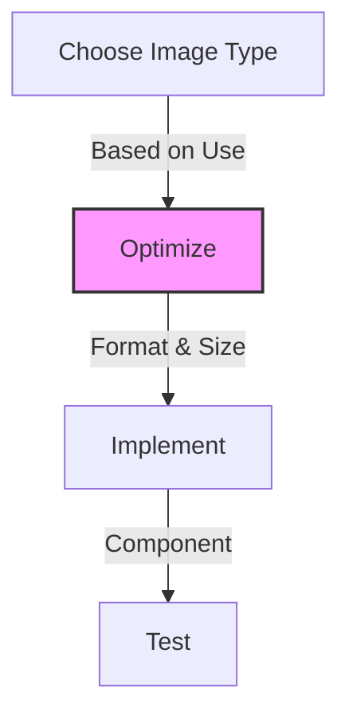

# Valentelligent AI Image Guidelines 🖼️

> 📚 **Prerequisites:** Read [README.md](../../../README.md) and [GUIDE.md](../../../GUIDE.md) first!

## Overview 🎯

This guide covers image optimization and implementation for the Valentelligent AI landing page.

## Quick Reference 📋



## Image Requirements 📏

### Hero Section
- Desktop: 1920x1080px
- Tablet: 1024x768px
- Mobile: 640x480px
- Format: WebP
- Max size: 200KB

### Feature Cards
- Size: 800x600px
- Format: WebP/SVG
- Max size: 100KB

### Blog Posts
- Thumbnail: 400x300px
- Header: 1200x630px
- Format: WebP
- Max size: 150KB

## Implementation Guide 💻

### 1. Responsive Images

```jsx
<picture>
  <source
    media="(min-width: 1024px)"
    srcSet="/images/hero-desktop.webp"
  />
  <source
    media="(min-width: 640px)"
    srcSet="/images/hero-tablet.webp"
  />
  
</picture>
```

### 2. Lazy Loading

```jsx
<Image
  src="/images/feature.webp"
  alt="Feature"
  loading="lazy"
  className="feature-image"
/>
```

### 3. SVG Implementation

```jsx
<svg className="icon-primary">
  <use href="/icons/sprite.svg#feature-icon" />
</svg>
```

## Optimization Checklist ✅

- [ ] Compress images
- [ ] Convert to WebP
- [ ] Implement responsive sources
- [ ] Add lazy loading
- [ ] Test performance

## Directory Structure 📁

```
public/
├── images/
│   ├── hero/
│   │   ├── desktop/
│   │   ├── tablet/
│   │   └── mobile/
│   ├── features/
│   ├── blog/
│   └── testimonials/
└── icons/
    └── sprite.svg
```

## Best Practices 🌟

1. **Format Selection**
   - Photos: WebP
   - Icons: SVG
   - Animations: WebP

2. **Performance Tips**
   - Use responsive images
   - Implement lazy loading
   - Optimize file size
   - Use CDN when possible

3. **Accessibility**
   - Meaningful alt text
   - Proper ARIA labels
   - Contrast ratios

## Tools & Resources 🛠️

1. **Image Optimization**
   - [Squoosh](https://squoosh.app)
   - [TinyPNG](https://tinypng.com)
   - [SVGOMG](https://jakearchibald.github.io/svgomg)

2. **Performance Testing**
   - Lighthouse
   - WebPageTest
   - Browser DevTools

## Next Steps 🚀

1. Return to [GUIDE.md](../../../GUIDE.md) for component integration
2. Review performance metrics
3. Optimize existing images

Remember: Optimized images = Better performance! 💪
