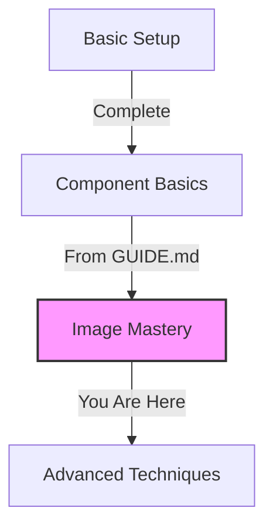

# Mastering Images in Valentelligent AI 🖼️

> 📚 **Prerequisites:** Make sure you've read [README.md](../../../README.md) and [GUIDE.md](../../../GUIDE.md) first!

## Your Image Journey 🚀



## Image Types & Usage 📸

### 1. Hero Images
```jsx
// From our Hero component in GUIDE.md
<div className="hero-image-container">
  <Image
    src="/hero-image.webp"
    alt="AI Technology Visualization"
    priority  // Load first!
    className="hero-image"
  />
</div>

// Required sizes
Desktop: 1920x1080px
Tablet:  1024x768px
Mobile:  640x480px
```

### 2. Feature Cards
```jsx
// Matching our Feature component style
<Card className="feature-card">
  <Image
    src="/feature-image.webp"
    alt="Feature Description"
    className="feature-image"
    loading="lazy"  // Performance optimization
  />
</Card>

// Required sizes
800x600px (will scale automatically)
```

### 3. Blog Post Images
```jsx
// Coordinates with Blog component
<article className="blog-post">
  <Image
    src="/blog-image.webp"
    alt="Blog Post Title"
    className="blog-image"
    loading="lazy"
  />
</article>

// Required sizes
Thumbnail: 400x300px
Header: 1200x630px
```

## Implementation Examples 💡

### 1. Responsive Hero Image
```jsx
// Combines concepts from GUIDE.md
<picture>
  {/* Mobile first */}
  <source
    media="(max-width: 640px)"
    srcSet="/hero-mobile.webp"
    type="image/webp"
  />
  {/* Tablet */}
  <source
    media="(max-width: 1024px)"
    srcSet="/hero-tablet.webp"
    type="image/webp"
  />
  {/* Desktop */}
  <source
    srcSet="/hero-desktop.webp"
    type="image/webp"
  />
  {/* Fallback */}
  
</picture>
```

### 2. Animated Feature Icons
```jsx
// Using Framer Motion from GUIDE.md
<motion.div
  initial={{ opacity: 0, scale: 0.5 }}
  animate={{ opacity: 1, scale: 1 }}
  className="feature-icon"
>
  <svg className="w-12 h-12 text-primary">
    {/* Icon paths */}
  </svg>
</motion.div>
```

### 3. Lazy-Loaded Gallery
```jsx
// Performance optimization
const Gallery = () => {
  const [isVisible, setIsVisible] = useState(false);
  
  return (
    <div className="image-gallery">
      {images.map((image) => (
        <Image
          key={image.id}
          src={image.src}
          alt={image.alt}
          loading="lazy"
          className="gallery-image"
        />
      ))}
    </div>
  );
};
```

## Advanced Optimization 🔧

### 1. Format Selection
```javascript
const imageFormats = {
  photos: ['webp', 'jpg'],  // Regular images
  icons: ['svg'],           // UI elements
  animations: ['gif', 'webp'] // Animated content
};
```

### 2. Size Optimization
```bash
# Recommended tools
┌─────────────┬────────────────┐
│ Image Type  │ Max Size (KB)  │
├─────────────┼────────────────┤
│ Hero        │      200       │
│ Feature     │      100       │
│ Thumbnail   │       50       │
│ Icon        │       10       │
└─────────────┴────────────────┘
```

### 3. Loading Strategies
```jsx
// Priority loading for above-fold
<Image priority src="/hero.webp" />

// Lazy loading for below-fold
<Image loading="lazy" src="/content.webp" />

// Eager loading for critical UI
<Image loading="eager" src="/logo.svg" />
```

## Performance Tips 🚀

1. **Image CDN Usage**
   ```jsx
   // Use image CDN for dynamic resizing
   <Image
     src={`https://cdn.example.com/image.jpg?w=${width}&q=${quality}`}
     alt="Dynamic Image"
   />
   ```

2. **Art Direction**
   ```jsx
   // Different images for different screens
   <picture>
     <source 
       media="(min-width: 1024px)"
       srcSet="/desktop-optimized.webp"
     />
     
   </picture>
   ```

## Directory Structure 📁

```bash
public/
├── images/
│   ├── hero/          # Hero section (high priority)
│   ├── features/      # Feature illustrations
│   ├── blog/          # Blog post images
│   └── gallery/       # Image gallery
└── icons/
    └── sprite.svg     # SVG sprite sheet
```

## Success Checklist ✅

Before deployment:
- [ ] All images optimized
- [ ] Responsive images implemented
- [ ] Lazy loading configured
- [ ] Alt text added
- [ ] Performance tested

## Next Steps 🎯

1. **Review Performance**
   - Use browser dev tools
   - Check loading times
   - Verify image sizes

2. **Optimize Further**
   - Implement caching
   - Use CDN
   - Monitor metrics

Remember: Great images make great websites! 🌟

Need more help? Return to [GUIDE.md](../../../GUIDE.md) for component integration tips!
